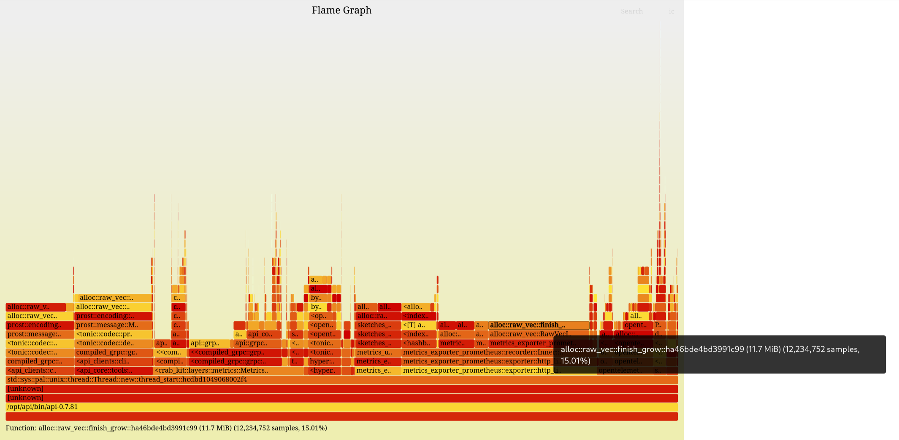

# tracelloc

Simple memory tracing program using eBPF.

tracelloc will hook any running application's allocator to keep track of
allocations, and most importantly, the stack traces that did the allocation.
This way, a synthetic view of what parts of a program allocated memory that
was not released yet.

Using this, a program whose memory grows uncontrollably with no obvious culprit
can be found. By tracking the total memory allocated by a code path, data
accumulated by a container can be tracked.

This is similar to Go's pprof heap profiler. However, tracelloc can be used on
languages with no garbage collector, like C or Rust. Another notable difference
is, since the instrumented program does not track its allocations through a gc,
only allocations performed while instrumenting will be shown.

## Features

tracelloc is quite small at the moment, but provides the minimum features for
proper troubleshooting:

- traces `malloc`, `calloc`, `realloc`, `reallocarray`, `free`, which is enough
  for Rust programs using the default global allocator from the glibc
- symbolizes stack traces, and supports Rust demangle format
- periodically output outstanding allocations and allocators
- outputs all known allocations and allocators in a flamegraph-compatible file
  for easy visual analysis

## Limitations

- requires kernel 5.8+ due to the usage of eBPF ring buffer maps
- requires frame pointers to be enabled for proper stack trace unwinding
- does not tracks allocations performed through `mmap`/`munmap`
- programs not using the glibc's allocators are not supported, which include
  Go programs or Rust programs using musl or an alternate allocator like
  `jemalloc`
- debug symbols are not loaded, so only function names are part of the traces,
  not source files nor line numbers
- stack trace filtering is hardcoded for common Rust noise (tokio runtime,
  panic harness, futures::poll, etc)

## Building

By using Rust for both the eBPF probes and userspace application, tracelloc
only needs a working Rust toolchain.

```bash
# Install bpf-linker
cargo install bpf-linker
# Build eBPF probes
make build-ebpf
# Build main tracelloc binary
cargo build --release
```

tracelloc can then be found under `target/release/tracelloc`. eBPF probes are
bundled in the binary, so it is the only file needed.

## Usage

In its simplest form, tracelloc is pointed at a running process' pid:

```bash
tracelloc -p $(pidof your_app)
```

It will immediately start to output the top two allocations and allocators
every second (trace from an actual running gRPC API):

```
==> 2 top allocations out of 281885 for a total of 96.3 MiB
    0x0x0076065084e0a0: 3.25 MiB (682.577117136s old)
        0x00005e26d72af872: alloc::raw_vec::finish_grow::ha46bde4bd3991c99+0x32/0x76 in /opt/api/bin/api-0.7.81
        0x00005e26d72b0173: alloc::raw_vec::RawVecInner<A>::reserve::do_reserve_and_handle::h04c88c95d89dd8e2+0xb3/0xe9 in /opt/api/bin/api-0.7.81
        0x00005e26d72ad100: metrics_exporter_prometheus::formatting::write_metric_line::h5d313a43b1ec7bd8+0x400/0x590 in /opt/api/bin/api-0.7.81
        0x00005e26d72c4033: metrics_exporter_prometheus::recorder::Inner::render::h34d50b66c6115a80+0x3513/0x436b in /opt/api/bin/api-0.7.81
        0x00005e26d72a3900: metrics_exporter_prometheus::exporter::http_listener::HttpListeningExporter::handle_http_request::hadd464e9fdec0b26+0x150/0x85c in /opt/api/bin/api-0.7.81
         (1 filtered out)
        0x00005e26d72d302f: metrics_exporter_prometheus::exporter::http_listener::HttpListeningExporter::process_tcp_stream::{{closure}}::h9a934270862ef0a5+0xef/0x684 in /opt/api/bin/api-0.7.81
         (12 filtered out)
        0x00005e26d78fbb2b: std::sys::pal::unix::thread::Thread::new::thread_start::hcdbd1049068002f4+0x2b/0xf4 in /opt/api/bin/api-0.7.81
        0x000076065809ca94: ??? in /usr/lib/x86_64-linux-gnu/libc.so.6
        0x0000760658129c3c: ??? in /usr/lib/x86_64-linux-gnu/libc.so.6
    0x0x007605e4522830: 3.12 MiB (922.582285647s old)
        0x00005e26d72af872: alloc::raw_vec::finish_grow::ha46bde4bd3991c99+0x32/0x76 in /opt/api/bin/api-0.7.81
        0x00005e26d72b0173: alloc::raw_vec::RawVecInner<A>::reserve::do_reserve_and_handle::h04c88c95d89dd8e2+0xb3/0xe9 in /opt/api/bin/api-0.7.81
        0x00005e26d72ace97: metrics_exporter_prometheus::formatting::write_metric_line::h5d313a43b1ec7bd8+0x197/0x590 in /opt/api/bin/api-0.7.81
        0x00005e26d72c4033: metrics_exporter_prometheus::recorder::Inner::render::h34d50b66c6115a80+0x3513/0x436b in /opt/api/bin/api-0.7.81
        0x00005e26d72a3900: metrics_exporter_prometheus::exporter::http_listener::HttpListeningExporter::handle_http_request::hadd464e9fdec0b26+0x150/0x85c in /opt/api/bin/api-0.7.81
         (1 filtered out)
        0x00005e26d72d302f: metrics_exporter_prometheus::exporter::http_listener::HttpListeningExporter::process_tcp_stream::{{closure}}::h9a934270862ef0a5+0xef/0x684 in /opt/api/bin/api-0.7.81
         (12 filtered out)
        0x00005e26d78fbb2b: std::sys::pal::unix::thread::Thread::new::thread_start::hcdbd1049068002f4+0x2b/0xf4 in /opt/api/bin/api-0.7.81
        0x000076065809ca94: ??? in /usr/lib/x86_64-linux-gnu/libc.so.6
        0x0000760658129c3c: ??? in /usr/lib/x86_64-linux-gnu/libc.so.6
==> 2 top allocators out of 9319:
     0: 14.0 MiB
        0x00005e26d6dac642: alloc::raw_vec::finish_grow::h4a7b95201c7687d5+0x32/0x76 in /opt/api/bin/api-0.7.81
        0x00005e26d6dac7f0: alloc::raw_vec::RawVec<T,A>::grow_one::h241a9050add95ec2+0x90/0xc6 in /opt/api/bin/api-0.7.81
        0x00005e26d6dae96c: prost::encoding::message::merge_repeated::hb116e2fa05af20fc+0xdc/0x1f3 in /opt/api/bin/api-0.7.81
        0x00005e26d6dc1734: prost::message::Message::decode::hda5929af80d8dd8b+0xd4/0x30b in /opt/api/bin/api-0.7.81
        0x00005e26d6db6066: <tonic::codec::prost::ProstDecoder<U> as tonic::codec::Decoder>::decode::ha070f519266c82f9+0x26/0xb1 in /opt/api/bin/api-0.7.81
        0x00005e26d6db9be8: <tonic::codec::decode::Streaming<T> as futures_core::stream::Stream>::poll_next::hdb88b4eadbb03728+0xb8/0x2d3 in /opt/api/bin/api-0.7.81
        0x00005e26d6d8ca7f: compiled_grpc::grpc::domain::v2beta1::api_client::ApiClient<T>::update_dns_zone_records::{{closure}}::h5c59d08fa815f951+0x115f/0x2616 in /opt/api/bin/api-0.7.81
         (1 filtered out)
        0x00005e26d6d8aa24: <api_clients::clients::domain_v2beta1::Domain as api_clients::clients::domain_v2beta1::DomainApiExt>::change_private_dns_zone::{{closure}}::h46f6195ac73b74b6+0x7d4/0x1611 in /opt/api/bin/api-0.7.81
         (1 filtered out)
        0x00005e26d6cc7f2e: <api_core::tools::async_backends::TokioBackend as api_core::tools::async_backends::AsyncBackend>::create_dns_records::{{closure}}::{{closure}}::haaa2b41f3e3a8b72+0x7ee/0x844f in /opt/api/bin/api-0.7.81
         (12 filtered out)
        0x00005e26d78fbb2b: std::sys::pal::unix::thread::Thread::new::thread_start::hcdbd1049068002f4+0x2b/0xf4 in /opt/api/bin/api-0.7.81
        0x000076065809ca94: ??? in /usr/lib/x86_64-linux-gnu/libc.so.6
        0x0000760658129c3c: ??? in /usr/lib/x86_64-linux-gnu/libc.so.6
     1: 8.44 MiB
        0x00005e26d6dac642: alloc::raw_vec::finish_grow::h4a7b95201c7687d5+0x32/0x76 in /opt/api/bin/api-0.7.81
        0x00005e26d6dac7f0: alloc::raw_vec::RawVec<T,A>::grow_one::h241a9050add95ec2+0x90/0xc6 in /opt/api/bin/api-0.7.81
        0x00005e26d6dae96c: prost::encoding::message::merge_repeated::hb116e2fa05af20fc+0xdc/0x1f3 in /opt/api/bin/api-0.7.81
        0x00005e26d6dc1734: prost::message::Message::decode::hda5929af80d8dd8b+0xd4/0x30b in /opt/api/bin/api-0.7.81
        0x00005e26d6db6066: <tonic::codec::prost::ProstDecoder<U> as tonic::codec::Decoder>::decode::ha070f519266c82f9+0x26/0xb1 in /opt/api/bin/api-0.7.81
        0x00005e26d6db9be8: <tonic::codec::decode::Streaming<T> as futures_core::stream::Stream>::poll_next::hdb88b4eadbb03728+0xb8/0x2d3 in /opt/api/bin/api-0.7.81
        0x00005e26d6d8ca7f: compiled_grpc::grpc::domain::v2beta1::api_client::ApiClient<T>::update_dns_zone_records::{{closure}}::h5c59d08fa815f951+0x115f/0x2616 in /opt/api/bin/api-0.7.81
         (1 filtered out)
        0x00005e26d6d8aa24: <api_clients::clients::domain_v2beta1::Domain as api_clients::clients::domain_v2beta1::DomainApiExt>::change_private_dns_zone::{{closure}}::h46f6195ac73b74b6+0x7d4/0x1611 in /opt/api/bin/api-0.7.81
         (13 filtered out)
        0x00005e26d78fbb2b: std::sys::pal::unix::thread::Thread::new::thread_start::hcdbd1049068002f4+0x2b/0xf4 in /opt/api/bin/api-0.7.81
        0x000076065809ca94: ??? in /usr/lib/x86_64-linux-gnu/libc.so.6
        0x0000760658129c3c: ??? in /usr/lib/x86_64-linux-gnu/libc.so.6
```

We can see the Tonic stack has allocated a total of 14MB of memory when performing a call to an
external API, and has not released it yet. Note that this is a snapshot of what's known when the
information is printed out.

By using the `--flamegraph` argument, a flamegraph-compatible file can be written to disk and then
converted to svg using the [`flamegraph.pl`](https://github.com/brendangregg/FlameGraph) script:

```
$ tracelloc -p $(pidof your_app) --flamegraph app.fg
^C
$ flamegraph.pl < app.fg > app.svg
```

The generated svg shows an aggregated view, where each "sample" is one byte, so each part show how
much has been allocated in total. The above example leads to the following flamegraph:



*Tip*: in some cases, the leak may be in a library called by many code paths in the application. In
such a case, an inverted flamegraph in icicle form is helpful by grouping the top of the stack
traces instead of the bottom. Those are generated with the `--inverted --reverse` flags of
`flamegraph.pl`.

## TODO List

Non exhaustive list of what I want to do in the future:

- pprof compatible output
- better symbolication by not rolling my own and using addr2line and gimli crates
- alternative allocators support
  * jemalloc
  * musl
  * `mmap`/`munmap`
